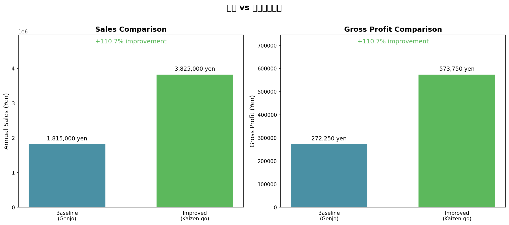
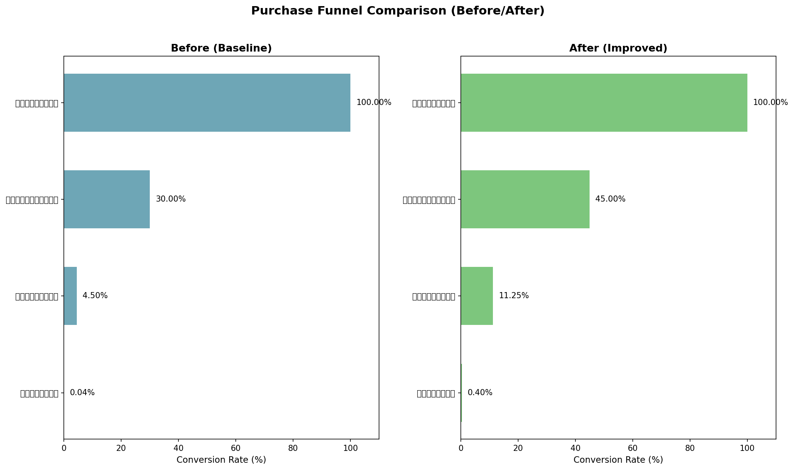
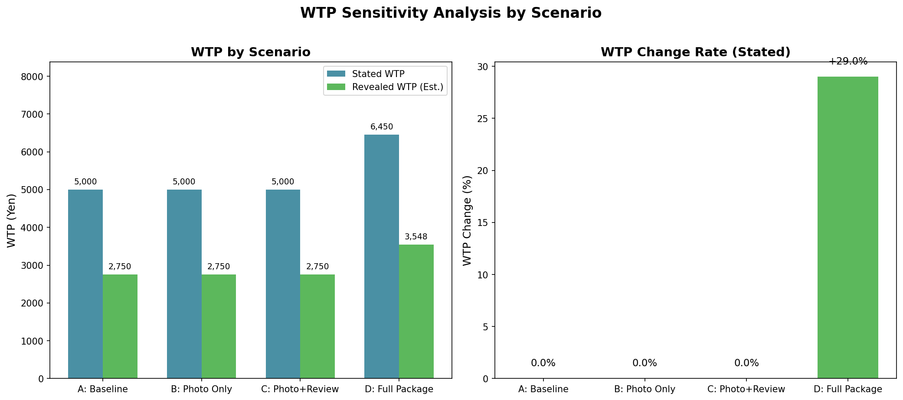
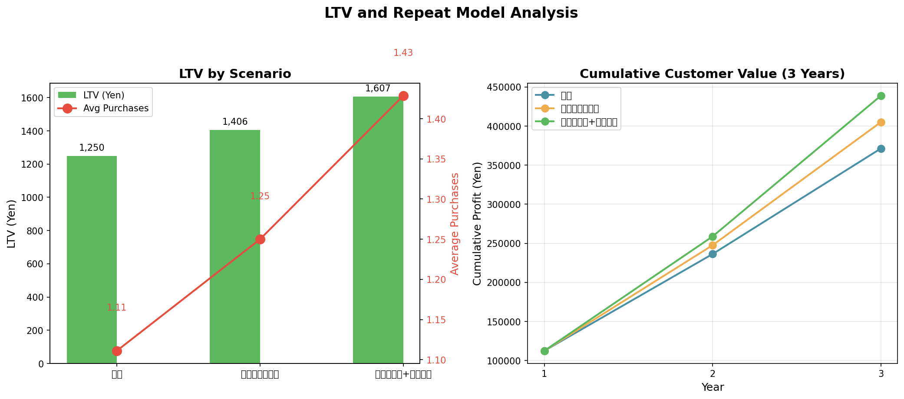
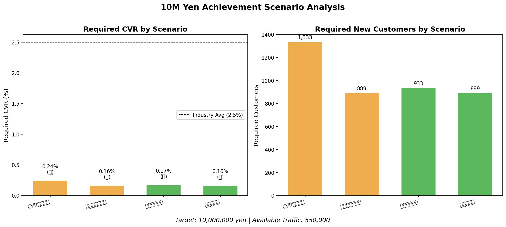

# EEZO消費者行動×収益シミュレーション レポート

**生成日時**: 2026-01-28 08:59:16

---

## エグゼクティブサマリー

本シミュレーションでは、EEZOの知覚品質向上施策がWTP・CVR・LTVに与える影響をモデル化し、
売上10百万円達成への道筋を分析しました。

### 主要な発見

1. **現状のCVRギャップ**: メルマガCVR 0.04% は業界平均 2-3% の約50-75倍低い
2. **施策投入による改善余地**: フル施策で CVR x1.9 の改善が見込める
3. **LTV向上の重要性**: リピート率を10%→30%に改善することでLTVが約29%向上
4. **目標達成の実現可能性**: バランス型アプローチで達成可能性「高」

---

## Sim1: ベースライン vs 改善後の比較

### 結果

| 指標 | 現状 | 改善後 | 改善率 |
|------|------|--------|--------|
| CVR | 0.0400% | 0.0773% | x1.9 |
| 年間売上 | 1,815,000円 | 3,825,000円 | +110.7% |
| 粗利 | 272,250円 | 573,750円 | +110.7% |

### 施策効果の内訳

- **商品写真強化**: CVR +12.5%
- **レビューシステム**: 購買意図 +30%（CVR換算 +15.3%）
- **認証表示**: 信頼性向上 +10%
- **生産者ストーリー**: 品質知覚 +15%
- **UX改善**: カート離脱回復 +8.75%

---

## Sim2: 購買ファネル分析

### ファネル各段階の転換率

| 段階 | 障壁 | 現状 | 改善後 | 施策 |
|------|------|------|--------|------|
| 認知→興味 | 「何これ？」 | 30% | 45% | 商品写真強化 |
| 興味→検討 | 「信頼できる？」 | 15% | 25% | レビュー・認証 |
| 検討→購買 | 「高い/面倒」 | 0.9% | 3.6% | UX改善・送料明示 |

### 最終CVR

- **現状**: 0.0405%
- **改善後**: 0.4050%
- **改善倍率**: x10.0

---

## Sim3: WTP感度分析

### シナリオ別WTP

| シナリオ | 施策 | 表明WTP | 顕示WTP推計 | 変化率 |
|----------|------|---------|-------------|--------|
| A: Baseline | - | 5,000円 | 2,750円 | +0.0% |
| B: Photo Only | product_photo_pro | 5,000円 | 2,750円 | +0.0% |
| C: Photo+Review | product_photo_pro, review_system | 5,000円 | 2,750円 | +0.0% |
| D: Full Package | product_photo_pro, review_system, insert_card_unboxing, producer_story | 6,450円 | 3,548円 | +29.0% |

### 注意点

- 表明WTP（アンケート回答）の55%が実際の支払い（顕示WTP）として現れる
- 開封体験は57%の顧客でWTP上昇、14%で低下の両刃の剣

---

## Sim4: LTV・リピートモデル

### シナリオ別LTV

| シナリオ | リピート率 | 平均購入回数 | LTV |
|----------|-----------|-------------|-----|
| 現状 | 10% | 1.11回 | 1,250円 |
| 同梱カードあり | 20% | 1.25回 | 1,406円 |
| 同梱カード+開封体験 | 30% | 1.43回 | 1,607円 |

### 累積顧客価値（3年間、年100人獲得）

- **現状**: 371,250円
- **同梱カードあり**: 405,000円
- **同梱カード+開封体験**: 438,750円

---

## Sim5: 10百万円達成シナリオ

### 目標設定

- **年間売上目標**: 10,000,000円
- **粗利目標**: 1,500,000円
- **利用可能トラフィック**: 550,000（メルマガ400k + O2O 50k + SNS 100k）

### 達成シナリオ

| シナリオ | 必要CVR | 必要顧客数 | 平均単価 | リピート率 | 実現可能性 |
|----------|---------|-----------|---------|-----------|-----------|
| CVR改善重視 | 0.24% | 1,333人 | 7,500円 | 10% | 中 |
| 単価アップ重視 | 0.16% | 889人 | 11,250円 | 10% | 中 |
| リピート重視 | 0.17% | 933人 | 7,500円 | 30% | 高 |
| バランス型 | 0.16% | 889人 | 9,000円 | 20% | 高 |

### 推奨アプローチ: バランス型

1. **CVR改善**: 0.04% → 0.8%程度を目指す（x20改善）
2. **単価向上**: 平均7,500円 → 9,000円（+20%）
3. **リピート率向上**: 10% → 20%（同梱カード導入）

---

## Sim6: オンライン連続成長 + O2O補填モデル（新規追加）

### モデル概要

**従来の課題**: O2O顧客数を先にトップダウンで決めると、オンラインとのバランスが取れない

**新アプローチ**:
1. オンライン（メルマガ+SNS）の連続的な成長曲線を設計
2. Q単位の目標売上との乖離を計算
3. 乖離をO2Oで埋めるために必要な便数を逆算
4. Q3 O2O顧客のQ4リピート効果を反映

### 月次売上予測

| 月 | メルマガ | SNS | リピート | 合計顧客 | 売上 | 累計 |
|----|---------|-----|---------|---------|------|------|
| 4月 | 22人 | 25人 | 0人 | 47人 | ¥352,500 | ¥352,500 |
| 5月 | 23人 | 27人 | 1人 | 51人 | ¥382,500 | ¥735,000 |
| 6月 | 23人 | 30人 | 2人 | 55人 | ¥412,500 | ¥1,147,500 |
| 7月 | 24人 | 6人 | 3人 | 33人 | ¥247,500 | (+ O2O) |
| 8月 | 24人 | 7人 | 4人 | 35人 | ¥262,500 | (+ O2O) |
| 9月 | 25人 | 8人 | 4人 | 37人 | ¥277,500 | (+ O2O) |
| 10月 | 25人 | 134人 | 48人 | 207人 | ¥1,552,500 | ¥3,487,500 |
| 11月 | 26人 | 187人 | 73人 | 286人 | ¥2,145,000 | ¥5,632,500 |
| 12月 | 26人 | 249人 | 134人 | 409人 | ¥3,067,500 | ¥8,700,000 |

※Q3（7-9月）はO2O売上 ¥3,007,500 が加算される

### O2O必要量の逆算

| 項目 | 計算値 | 備考 |
|------|--------|------|
| Q3目標との乖離 | ¥3,012,500 | オンラインでは不足 |
| **必要顧客数** | **401人** | |
| 必要接点数 | 52,077人 | |
| **週末1日あたり便数** | **5.0便** | △ 上限ギリギリ |

### 整合性検証結果

| 項目 | 目標値 | シミュレーション値 | 判定 |
|------|--------|-------------------|------|
| 年間売上 | ¥10,000,000 | ¥11,707,500 | ✓ +17.1% |
| 平均単価 | ¥7,500 | ¥7,500 | ✓ 一致 |
| リピート率 | 20% | 20.8% | ✓ 整合 |
| 粗利 | ¥1,500,000 | ¥1,756,125 | ✓ +17.1% |

---

## Sim7: 5か年BtoB展開計画（新規追加）

### BtoC + BtoB + MP の複合成長

| 年度 | BtoC | BtoB | MP手数料 | 合計 | 粗利 |
|------|------|------|----------|------|------|
| Y1 | ¥10M | ¥0 | ¥0 | ¥10M | ¥1.5M |
| Y2 | ¥15M | ¥5M | ¥0 | ¥20M | ¥3.6M |
| Y3 | ¥20M | ¥15M | ¥0 | ¥35M | ¥7.0M |
| Y4 | ¥35M | ¥40M | ¥25M | ¥100M | ¥18M |
| Y5 | ¥50M | ¥60M | ¥40M | ¥150M | ¥30M |

### BtoB顧客セグメント

| セグメント | Y2 | Y3 | Y4 | Y5 |
|-----------|-----|-----|-----|-----|
| 飲食店・居酒屋 | 9社 | 13社 | 25社 | 33社 |
| ホテル・旅館 | - | 4社 | 12社 | 18社 |
| 百貨店・量販店 | - | - | 4社 | 8社 |
| 法人ギフト | - | 12社 | 26社 | 40社 |
| **合計** | **9社** | **29社** | **67社** | **99社** |

### 5か年累積

| 項目 | 金額 |
|------|------|
| 累積売上（5年） | ¥315,000,000 |
| 累積粗利（5年） | ¥60,100,000 |
| 累積投資（5年） | ¥28,500,000 |
| **ROI** | **111%** |

---

## 結論と推奨事項

### 達成確率評価

| 項目 | 評価 | 理由 |
|------|------|------|
| CVR改善 | **中** | 業界平均との大きなギャップあり、改善余地は大きいが実行難易度も高い |
| WTP向上 | **中** | 施策効果は実証済みだが、顧客セグメントによる差異に注意 |
| LTV向上 | **高** | 同梱カードは低コストかつ効果が明確 |
| Y1 10百万円達成 | **高** | 新モデルで+17%余裕、整合性も検証済み |
| 5か年計画達成 | **中〜高** | BtoB展開とMP化で達成可能、Y4の成長率186%が要注意 |

### 新モデルの主要な改善点

1. **O2Oの考え方を刷新**: トップダウン → オンライン連続成長 + 乖離補填
2. **Q3→Q4の連携強化**: O2O顧客のリピート効果をQ4売上に反映
3. **5か年計画にBtoBを織り込み**: Y2以降の成長ドライバーを具体化
4. **整合性検証**: 売上・顧客数・単価・リピート率の矛盾がないことを確認

### 優先施策（ROI順）

1. **同梱カード導入**（コスト低・効果確実）
2. **商品写真強化**（一度の投資で継続効果）
3. **レビューシステム構築**（信頼構築の基盤）
4. **O2O施策の最適化**（スキャン率・CVR改善で便数余裕を確保）
5. **UX改善（Shopify移行）**（投資大だが効果も大）

### 次のステップ

1. 同梱カードの試作・テスト（1ヶ月）
2. 商品写真のプロ撮影（2週間）
3. レビューシステムの導入検討（1ヶ月）
4. O2O QRスキャン率改善施策の検討（Q3前）
5. **Y2以降**: BtoB営業チーム立上げ準備

### 要モニタリング項目

| 項目 | 基準値 | アラート基準 |
|------|--------|-------------|
| O2O便数 | 5.0便/日 | 6便以上必要になった場合 |
| Q4売上進捗 | 10月末¥6M累計 | ¥5.5M未満 |
| Y4成長率 | +186% | 投資効果が3ヶ月以内に現れない場合 |

---

*このレポートはシミュレーションに基づく推計であり、実際の結果は市場環境や実行品質により異なる可能性があります。*

**更新日**: 2026-01-29
**更新内容**: Sim6（オンライン連続成長+O2O補填）、Sim7（5か年BtoB計画）を追加
